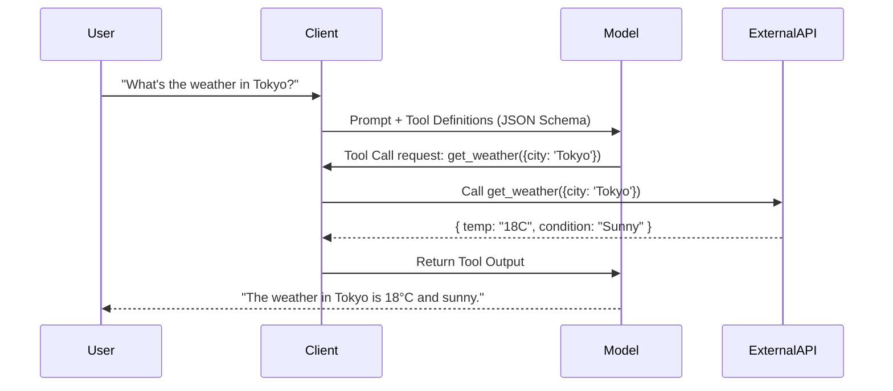

# Day 1: LLM APIs — Function Calling, Structured Outputs & Streaming

## 1. Overview
Modern Large Language Model (LLM) APIs have evolved beyond raw token generation into predictable, schema-guided reasoning engines. Today's focus covers three architectural fundamentals:
1. **Tool / Function Calling protocols**
2. **Deterministic Structured Outputs (JSON Schema enforcement)**
3. **Chunk-by-chunk Streaming & Server-Sent Events (SSE)**

---

## 2. Function Calling Protocol Mechanics
When models interact with external systems, function calling does not execute code directly in the model. Instead, it follows a 4-step loop:

### Key Considerations
- **Schema Strictness**: Setting `strict: true` guarantees adherence to the JSON schema using constrained decoding (grammar masks).
- **Parallel Tool Calling**: Models can output multiple tool invocations in a single turn. Clients must handle batch resolution or execute tools concurrently.

---

## 3. Structured Outputs vs Post-hoc JSON Parsing
- **Historical Approach**: Prompt engineering ("Output valid JSON only") + regex/Pydantic validation. Fragile and prone to hallucinations on long outputs.
- **Modern Grammar-Constrained Decoding**: The model's token sampling logits are constrained at each step using finite state machines (FSM) or context-free grammars, mathematically guaranteeing that generated tokens conform to the specified JSON Schema.

---

## 4. Streaming & Backpressure
Streaming responses leverage HTTP Server-Sent Events (`text/event-stream`).
- Handle delta tokens progressively for instant TTFT (Time To First Token).
- Accumulate partial tool call arguments (`delta.tool_calls[i].function.arguments`) across chunks until `finish_reason == "tool_calls"`.

---

## 5. Next Steps
- Deep-dive into Agentic Loops and Context Window Compression (Day 2).
